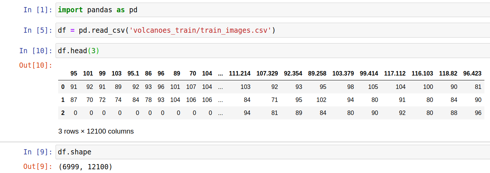
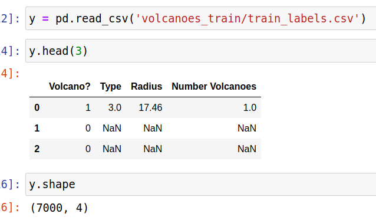
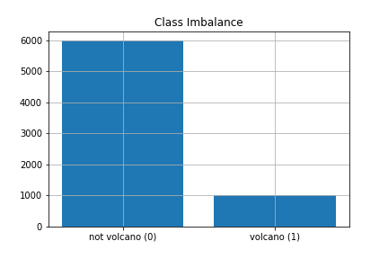
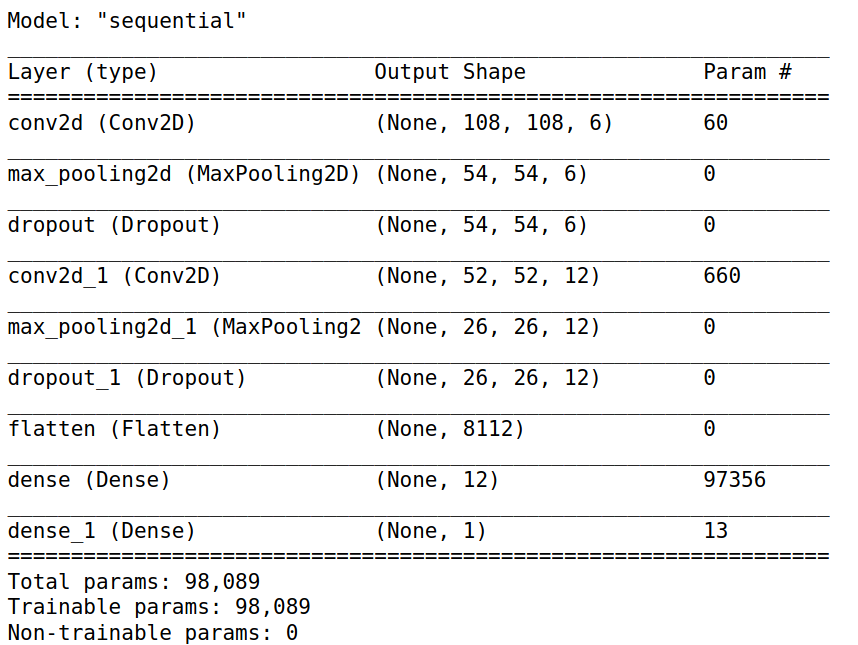
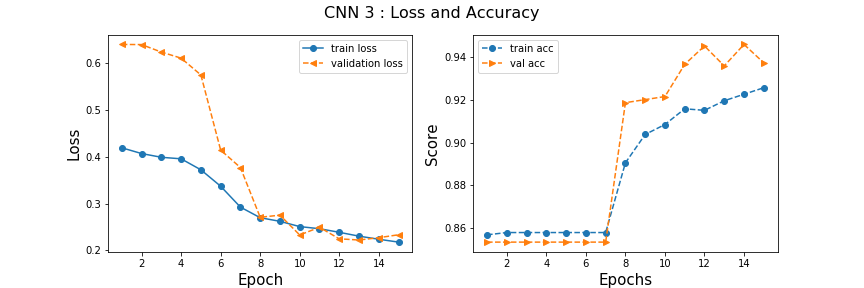
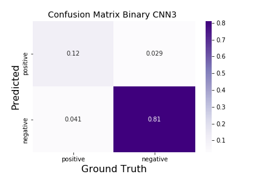

# Detecting Volcanoes on Venus with a CNN

 ## The Data
 This dataset contains images collected by the Magellan expedition to Venus. Venus is the most similar planet to the Earth in size, and therefore researchers want to learn about its geology. Venus' surface is scattered with volcanos, and the aim of this dataset was to develop a program that can automatically identify volcanoes (from training data that have been labeled by human experts between 1-with 98% probability a volcano- and 4-with 50% probability)</br>
link to data: https://www.kaggle.com/fmena14/volcanoesvenus?</br>

Images from this data source come in a csv of 7000 flattened images with 12100 pixels each with labels as flowed:</br>

**Labels**<br>
```Volcano?``` : Wether a images in of volcano or not  { binary }<br>
```Type``` : 1= defin itely a volcano,2 =probably, 3= possibly, 4= onlya pit is visible { float }</br>
```Radius```: is the radius of the volcan in the center of the image, in pixels { float}<br>
```Number Volcanoes```: The number of volcanoes in the image { float}<br>


<!-- </br> -->
**Can you tell if there is a volcano in these images?**
</br> As you can see, The images can be very hard to distinguish by eye. There relativly few planetary geologist specializig in the survface of venues. I hope to make a model that can classify wether there is a volcanoe in these images so that they very few experts can get right to the business of tudying volcanoes with out having to sift through and label images with there precious time.

<!-- --></br>

### **Binary Classification**
**Class Imbalance check**</br>
During EDA I want to see how my volcano or not volaco labels are disributed. <br>
 </br>
This shows some class imbalence with a ratio of 1:6 true positives. I will fisrt try to make a model without correcting for class imablence  and I will be keep an eye on my ratio of False negative to False positives to make sure my model does not misslead the planetary geologists by predicting under predicting the minority class.  </br>

**Archatecture**</br>
The architecture I found to work pretty well is as follows:</br>
```filters on fisrt convolution:```6<br>
```filter size:``` 3x3 pixles <br>
```activation:``` relu except for the last dence layer which was sigmoid<br>
```pooling```: MAx pooling (2x2)<br>
```stride size for convolutions```: 2<br>
```Regularization```: Drop out of .5 on the two convolutions<br>
```flattened steps```: after flattening 2 fully conected layers were used<br>

</br>

**Learning Rate**<br>
I fit this model, which I will call CNN3, with 15 epochs. Here is a plot of the learning rate:</br>
</br>

the loss and accuracy seem to peak out around 12 epochs. The validation accuracy seems to be very good and the loss seems to be minimized So i will evaluate my model with my hold out data <br>

**Accuracy with Holdout data =  .93 !!**

**Confusion Matrix**<br>
<br>
This confusion matrix looks very good considering 83% of the images are labeled to have no volcano.  say some more stuff comparinf fp and fn


**probabilities of images**
Lets look at the models class probabilities for a sample of the imagas.


