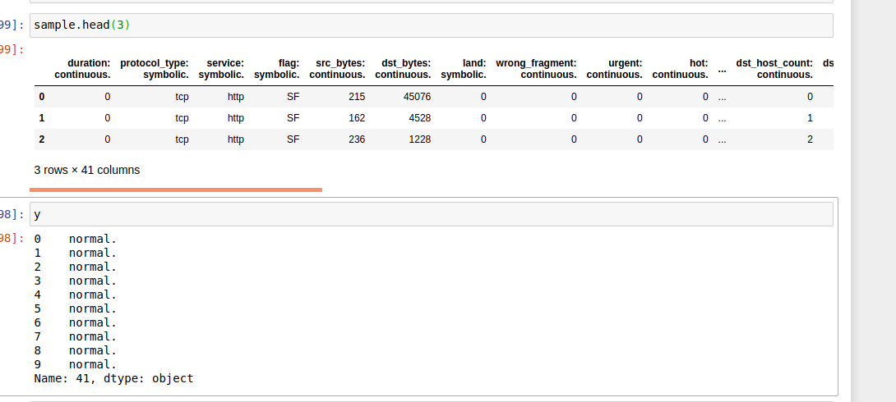

# Cap2-place-holder

## (1) Identifying Volcanoes On Venus:
 **The Data** 
- link to data: https://www.kaggle.com/fmena14/volcanoesvenus? 
- X: csv of 6999 flattened images with 12100 pixels each: 
 
- Labels: type column has a few different values that mark the confidence in the detection by labelers. 
  

**MVP**
- perform some techniques for class balancing
- perform some compression technique to help with dimensionality and training speed issues
- train CNN to identify volcano or no volcano and compare that to the human identified confidence scores
 
**If I can get to it**
- perform some clustering to identify subgroups. clusters may reveal possibly the size categories to be compared to the radius column in labels set. or clusters could help identify if there are multiple volcanoes in the image and can be compared to the 'number of volcanoes' column in labels set.
- compare the cnns performance with other types of models (non nn) with a roc curve.
 
**My Worries**
- Is this data set to 'stale' to look good in a resume? its data from the nineties
- I worry about the time and computing power it may take to train a CNN on my computer

## (2) Detection and Classification of LAN network Intrusion:
**The Data**
- link : http://kdd.ics.uci.edu/databases/kddcup99/kddcup99.html
- "nine weeks of raw TCP dump data were collected from a typical US air force LAN. During the use of the LAN, several attacks were performed on it. The raw packet data were then aggregated into connection data. Per record, extra features were derived, based on domain knowledge about network attacks. 
- There is 41 columns, and 4 classes in target column 
 

**MVP**
- perform some techniques to balance classes
- compare various models on their accuracy scores on classification
- try clustering for anomoly detection
- use profit curve to pick thresholds to try and prevent the more costly but less frequent attacks
 
**My worries**
- this data table is so large my jupyter notebook kernel crashed when I tried to load it into pandas. I will have to do some research on how to deal with this.
- also pretty old data

## (3) Identifying  of palm oil plantations from satellite Images: 
- data - https://www.kaggle.com/c/widsdatathon2019/data?select=holdout.csv
- identification of palm oil plantation in satellite images.
- have not looked as deep into this one. just putting here as another option in case you tell me i should  use a newer data set then the other two
