# Identifying Volcanoes with Convolutional Neural Networks

## **The Data**
This dataset contains images collected by the Magellan expedition to Venus. Venus is the
most similar planet to the Earth in size, and therefore researchers want to learn about
its geology. Venus' surface is scattered with volcanos, and this dataset was made to develop
a program that can automatically identify volcanoes. The training data has been
labeled by human experts.
<br>
link to data: https://www.kaggle.com/fmena14/volcanoesvenus?</br>

 
Images from this data source come in a CSV of 7000 flattened images with 12100 pixels each with labels as followed:</br>
 
**Labels**<br>
```Volcano?``` : Whether image is of a volcano or not { binary }<br>
```Type``` : 1 = definitely a volcano, 2 = probably, 3 = possibly, 4 = only a pit is visible { int }</br>
```Radius```: The radius of the volcano in the center of the image, in pixels { float }<br>
```Number Volcanoes```: The number of volcanoes in the image { float }

<br>


<!-- </br> -->
**Can you tell if there is a volcano in these images?**<br>
</br>
As you can see, volcanoes can be very hard to distinguish by eye. There are relatively few planetary geologists specializing in the surface of Venus.
I hope to make a model that can classify whether or not there is a volcano in these images so that the few experts can get right to the business of studying volcanoes
without having to sift through and label images first.


<!-- --><br>

## **Binary Classification: Volcano or Not?**
**Class Imbalance check**</br>
During EDA I checked to see how the volcano or not volcano labels are distributed. <br>
</br>The histogram above shows a class imbalance with a ratio of 1:6 positive class. I will first try to make a model without correcting for class imbalance and see how it scores. I will pay close attention to the ratio of false negatives to false positives to make sure my model does not mislead planetary geologists by under-predicting the minority class. </br>
 
**Architecture**</br>The first architecture I tried is shown below: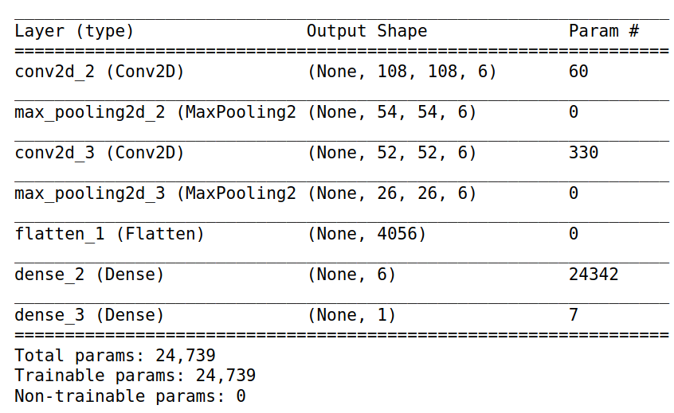<br>
I used relu activation for each layer except the last where I used sigmoid to create a binary output. I  chose an adam optimizer and a loss function of binary cross-entropy. The learning curve is as follows:<br>
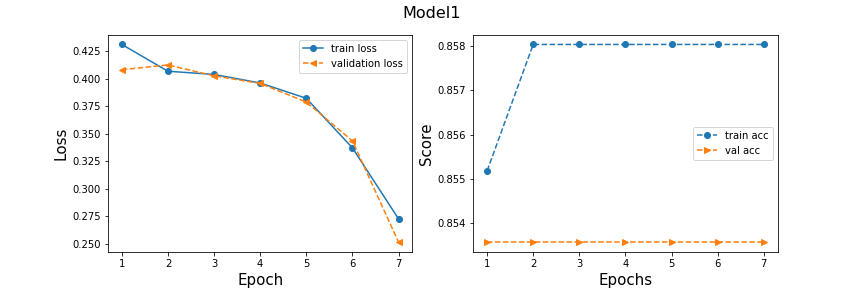<br>
The loss has good improvement over epochs with this model but the accuracy seems to be stalled out. Because the validation accuracy is not increasing over epochs, instead of letting it fit longer, I decided to go ahead and modify the architecture. <br>
I went through a few iterations of architecture, adding drop out to prevent overfitting, and adding more filters until I came up with an architecture I was happy with.<br>

**Better Architecture**<br>
The architecture I found to work very well is as follows:</br>
```filters:```6 on the first layer, 12 on the second layer<br>
```filter size:``` 3x3 pixels <br>
```activation:``` relu except for the last dense layer, which is sigmoid<br>
```pooling```: max pooling (2x2)<br>
```stride size for convolutions```: 2<br>
```regularization```: dropout of .5 on the two convolutions<br>
```flattened steps```: after flattening, 2 fully connected layers were used with the first one having 12 nodes and the last having 1<br>

</br>

**Learning Rate**<br>
I fit this model, which I will call CNN3, with 15 epochs. Here is a plot of the learning rate:</br>
</br>
 
The loss and accuracy seem to peak out around 12 epochs. The validation accuracy seems to be very good and the loss seems to be minimized. Next, I evaluate my model with my holdout data. <br>


### **Predictions On Hold-out Data With a Binary Classification CNN**
 
>**Accuracy =  .93**<br>
>**Precision = .98**<br>
>**Recall = .97**
 
Looking at a sample of hold-out images we can see how well the CNN was able to pick up on signs of volcanoes that, in some cases, is very hard to see with the eye.
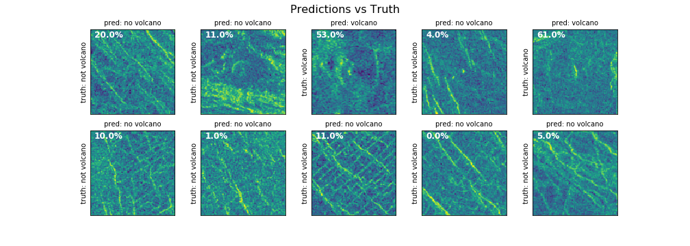<br>
The white annotation is the predicted probability of the presence of at least one volcano. The default threshold of .5 was used in the training of the model. We can see from the histogram of predicted probabilities and the confusion matrix below, that the default value will work very well with our choice of the sigmoid output layer.


<!--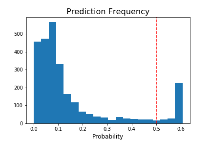-->

**Confusion Matrix**<br>
<br>
This confusion matrix looks very good considering 83% of the holdout images are labeled to have no volcano.  There is a slightly higher percentage of false negatives than false positives with this model. More false negatives may be a problem if the scientists looking to study these images do not want to miss any volcanoes and would rather have some negative images then miss a positive. But if this classification was being done as a preparation for further space missions, you would want the false positives to be lower then false negatives because of the high cost of space missions. To customize this model to one purpose or another the threshold could be fine-tuned with a profit curve.


### **Conculsion on Binary Classification.**<br>
Even with a class imbalance and a shallow convolutional neural network architecture, this model was able to predict the holdout data with 93% accuracy. Depending on the use of this model the threshold for predicting could be shifted to control the FN/FP ratio as desired.


______________
## **Recognizing the radius of a volcano.**
 
A target column is given in the dataset that is the radius in pixel of single volcano images. In this section, I will attempt to use the same architecture as the binary classification CNN to predict the radii of volcanoes in the images captured during the Magellan expedition. <br>

**To convert the model to predict a continuous range of numbers, I made the following changes:**<br>
- The output dense layer has a linear activation function so that the output can be any number.
- The loss function and metric for evaluation are the mean absolute error and mean squared error respectively.
 
I filtered the data set to only samples that have a radius measurement. This brought the sample size down to 1000 samples. I will leave this small for now to see how the CNN performs. Below is a histogram of radii showing two clear sizes of volcanoes. There is a majority type that is roughly 40 pixels across and a minority type that are small, at about 10 pixels across. <br>
<br>


On the first training run of this CNN with this dataset, I ran it for the same amount of epochs that I used to train this similar architecture for binary classification. It showed not much learning:<br>
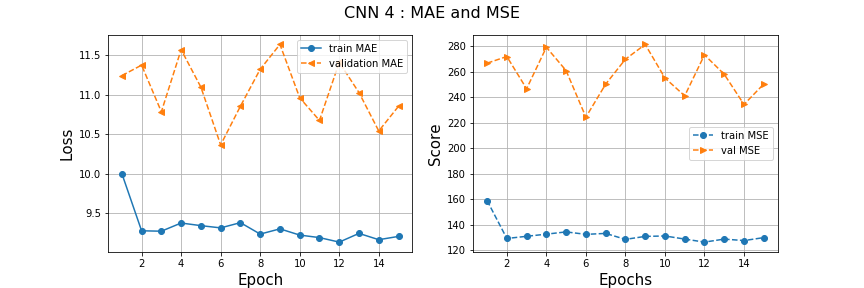<br>
 
This architecture is much better at predicting if a volcano is in the picture, then predicting the radius of volcanos. If we had as many samples for the regression as we did for the classification this may be a different story. <br>
 
I decided to run the model for many more epochs to see if this would eventually bring the MSE down.  <br>

Below is a plot of the first 100 epochs. <br>
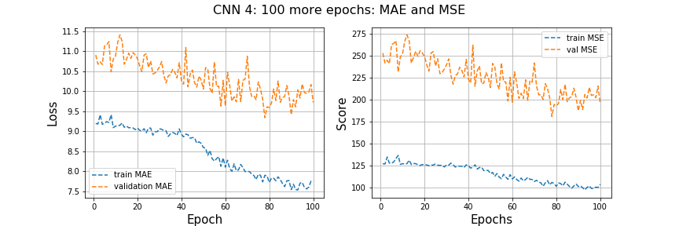<br>
It looks like the MSE may still come down so I fit again with 200 more epochs:<br>
 
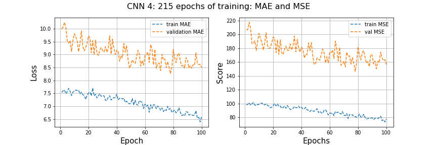<br>
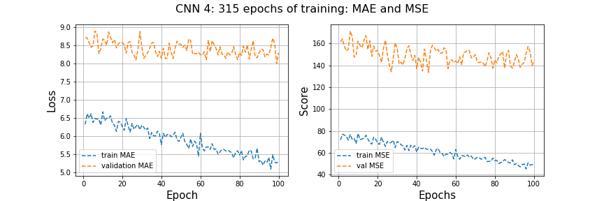
<br>
After over 315 epochs with this same architecture, it seems that the validation scores are evening out and the train sores are going down. This might be a sign of overfitting. To try and get the MSE and MAE lower I would like to try two things and compare them: make a deeper CNN, and add augmentation to the training images.


### **Training a Deeper CNN** <br>
I used the same architecture as before but added 2 additional layers of convolution with increasing filter size, along with pooling and drop out for both layers. I added another flattened layer with 24 nodes. The architecture is shown below.<br>
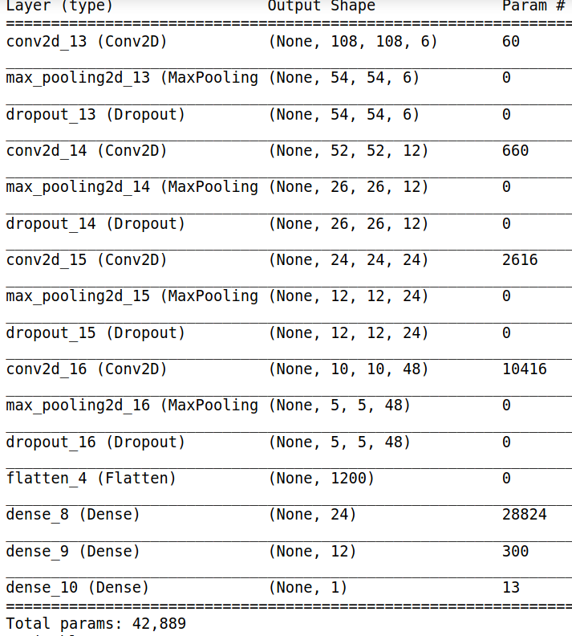<br>
 
Below is a plot of the MAE and MSE of 200 epochs of training with this deeper CNN.<br>
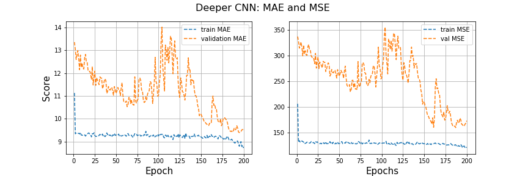<br>
This model seems like it is moving in the right direction but the MSE at the end is still much higher than the MSE that the shallow CNN left off at. I will run the deep CNN for another 115 epoch to get it to the same training time as the shallow CNN for comparison.<br>

 
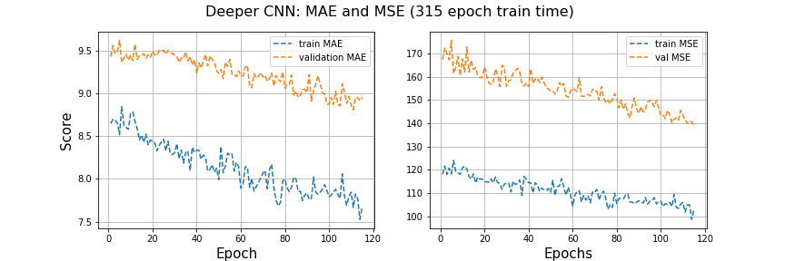<br>
After 315 epochs this model has now reached the same MSE as the shallow model, but this one seems to be still decreasing, unlike the shallow model. This is promising but due to time constraints I will not be able to run for hundreds of more epochs at this time.


### **Trying Augmentation**<br>
Image augmentation is a way to give the training set more variation. In theory, it helps with overfitting and general improvement of a model's prediction ability.<br>
 
I wrote an augmentation function that will take a batch of images and give them a chance of being flipped horizontally, flipped vertically, or  cropped.  I then created a generator function for this augmentation function that was used while fitting the CNN so that each batch of images fit would get a chance at augmentation. Below is a sample of the augmentation an image may go through. <br>
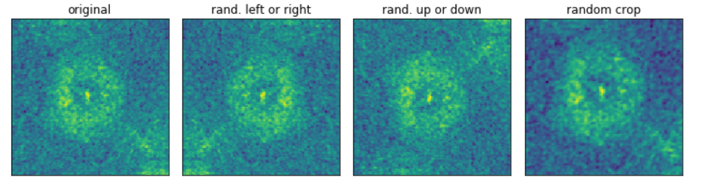<br>


Adding the augmentation generator to the input of the CNN **drastically** increased the fitting speed. Because of the time constraints on this project, I decided to just pick two of the augmentation options, flip horizontally, and crop. <br>
Below is a plot of 5 epochs of training with augmentation. This training with augmentation was done on the pre-trained shallow model so I could compare the effects of deepening the network vs augmentation.
 
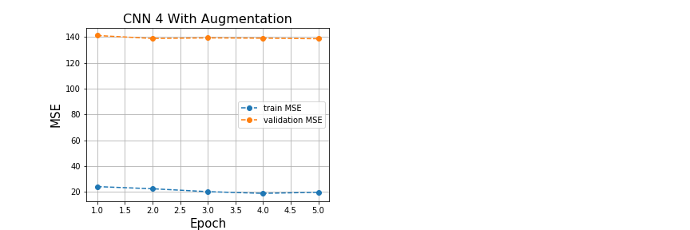<br>
 
The validation MSE seems to still be around 140.
Given more time I would let this shallow CNN train for much longer with the augmentation generator to see if the MSE can come down some more.

 
 
### **Predicting radii on holdout data**
with deep network: **RMSE = 10.42** .......... **R^2 = .12**<br>
with augmentation: **RMSE = 11.08** ..........**R^2 =  .008**<br>
 
The deep network seemed to explain a little more variance in the data but in general, both R^2 is very bad. The RMSE for both is around 11 which large considering the volcanoes span from about 5 pixels to 38 or so.
 
<!--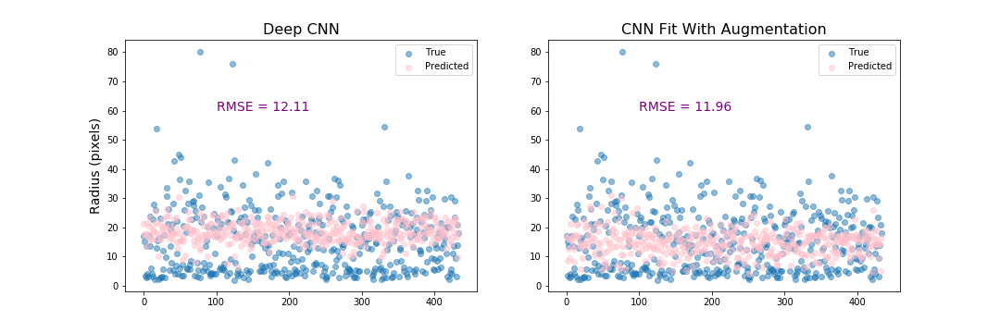<br>-->
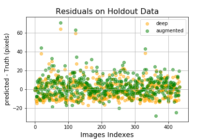<br>
 
Below is a histogram of the true radii, and both model's predictions. I wanted to see if the model picked up on the different groups of volcanos but it appears that the model is just predicting around the average.
 
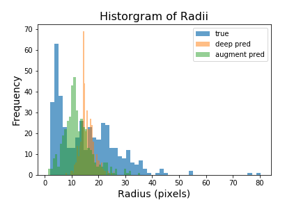<br>


________
 
# Conclusion
- A very simple CNN did a great job of predicting the presence of a volcano in an image. 
- This classification model could be trusted to aid in the work of planetary geologists and can be tailored for different ratios of false positives to false negatives by picking an appropriate threshold to apply to the output of the model.
- The same architecture and training time did very poorly when adapted for use as a regression model to predict radii of volcanoes and wth the time allowed I was not able to make a good model for this application.
- Moving forward I believe a more useful model could be made to predict which group (large or small) a volcano is in. Or, a model that does object detection to be able to check for one or more volcanoes anywhere in an image.
 
 

 


